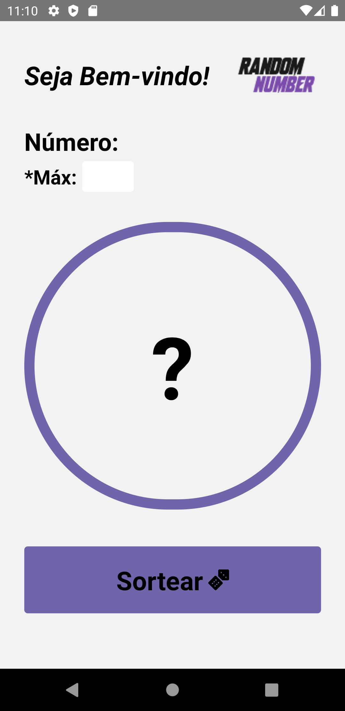
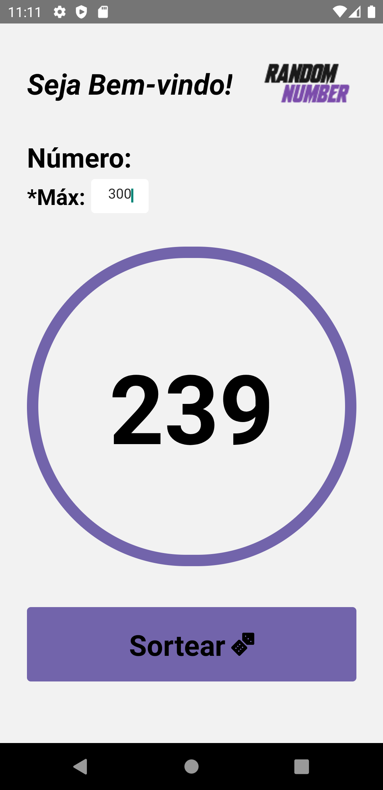

<h1 align="center">Random Number 🎲</h1>

Projeto criado para sortear números aleatóriamente, ele visa a facilitar sorteios que são feitos para que tudo possa ser feito da maneira mais clara e rápida possível.

  

#

  

  

  

#

Instruções de Instalação
=================
**1) Clone e instale as dependências:**
* 1.1) `git clone https://github.com/Brunomello-xD/RandomNumber.git`
* 1.2) `cd RandomNumber` - CD no diretório de projeto recém-criado.
* 1.3) Instale os pacotes necessários com `yarn install` ou `npm install`

**2) Inicie seu projeto:**
* **[IOS]** - `yarn ios`
* **[ANDROID]** - `yarn android`

### 🛠 Tecnologias

As seguintes ferramentas foram usadas na construção do projeto:

- [React Native](https://reactnative.dev/)
- [react-native-responsive-screen](https://www.npmjs.com/package/react-native-responsive-screen)

Feito com :heart:	 por [Bruno Mello](https://www.linkedin.com/in/bruno-mello-14058819b/?lipi=urn%3Ali%3Apage%3Ad_flagship3_feed%3BIBMlTz6fSoaFIdcA5Dyn0Q%3D%3D&licu=urn%3Ali%3Acontrol%3Ad_flagship3_feed-nav.settings_view_profile) :eyes:	
